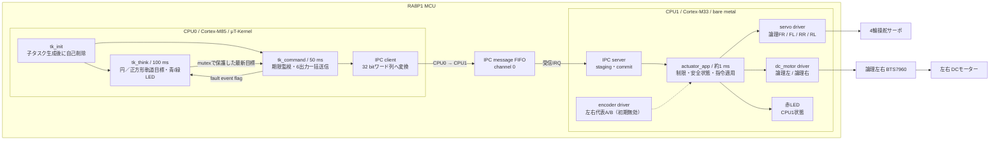
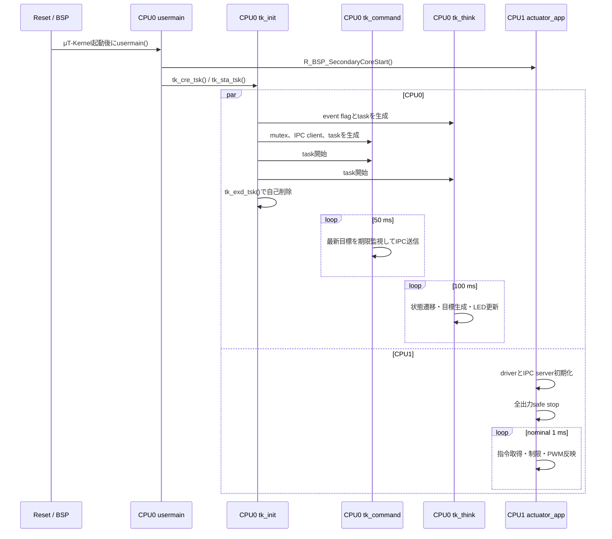
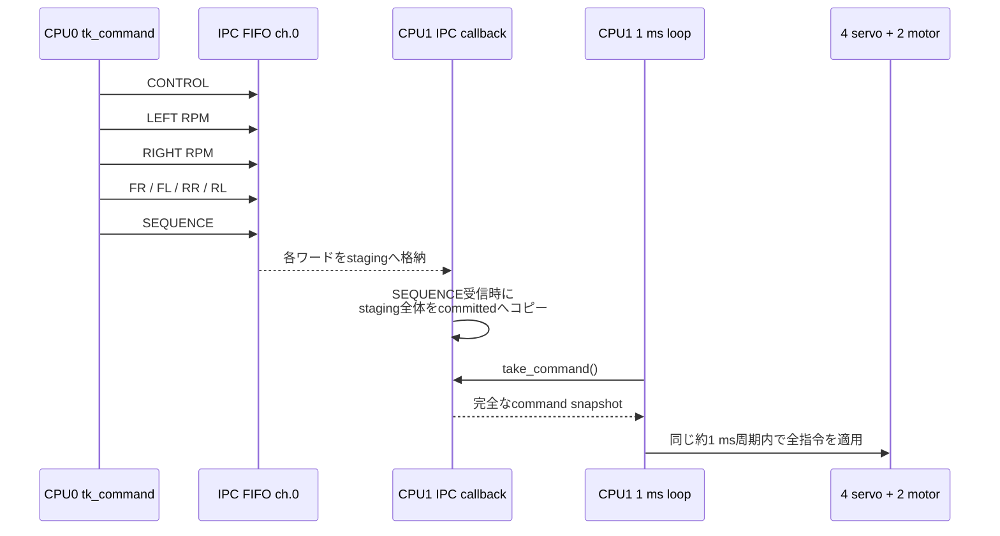
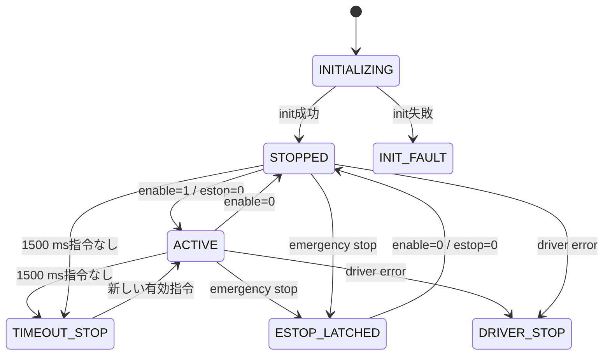
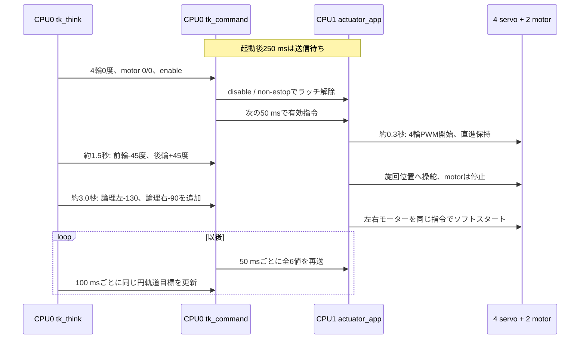
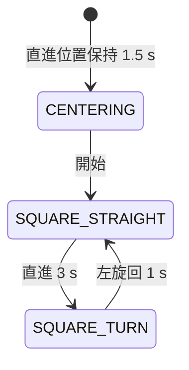
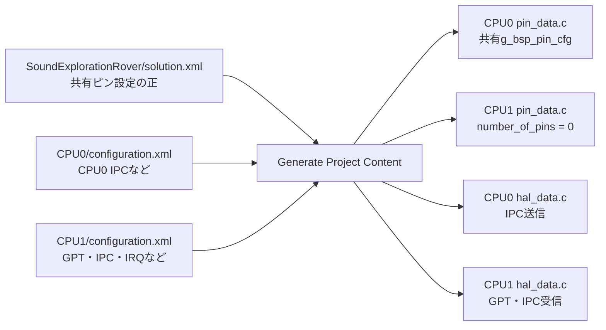

# RA8P1 ソフトウェア設計書

最終更新: 2026-08-19 / 対象: `firmware/ra8p1/` の現行実装

## 1. 目的と設計方針

この文書は、Sound Exploration RoverのRA8P1版について、CPU0とCPU1の責務、μT-Kernelタスク、CPU間通信、アクチュエータ制御、安全動作、LED表示、FSP生成コードとの境界を現行ソースに対応させて説明する。

設計上の要点は次のとおりである。

1. CPU0（Cortex-M85）はμT-Kernel上で上位判断と指令送信を行う。
2. CPU0の`tk_init`、`tk_think`、`tk_command`は、それぞれ`tk_cre_tsk()`で生成する独立カーネルタスクである。
3. CPU1（Cortex-M33）はベアメタルの約1 msループで指令を検証し、4サーボと論理左右DCモーターを駆動する。
4. 6個のアクチュエータ指示値は、IPCの`SEQUENCE`をcommit markerとして1つのスナップショットで確定する。
5. CPU0とCPU1は1個のRA8P1内の2コアであり、物理ピンを共有する。ピン多重化設定はSolutionを正として一元管理する。

## 2. システム全体像

| 項目 | CPU0 | CPU1 |
|---|---|---|
| コア | Cortex-M85 | Cortex-M33 |
| 実行方式 | μT-Kernel 3.0 | ベアメタル無限ループ |
| 主責務 | 思考、走行目標生成、IPC送信、CPU0異常表示 | IPC受信、制限、安全監視、PWM/GPIO制御 |
| 主周期 | command 50 ms、think 100 ms | nominal 1 ms |
| IPC channel 0 | 送信、ポーリング、callbackなし | 受信IRQ、callbackあり |
| LED | 青: 状態、緑: heartbeat/fault | 赤: heartbeat/driver error |



CPU1からCPU0へ返すstatus型とメッセージIDは予約済みだが、逆方向IPCは未実装である。現状の制御経路はCPU0からCPU1への一方向である。

## 3. ソースコード構成

```text
firmware/ra8p1/
├─ SoundExplorationRover/
│  └─ solution.xml                    デュアルコアSolution、共有ピン設定
├─ common/
│  └─ ipc_message.h                   CPU0/CPU1共通IPC契約
├─ SoundExplorationRover_CPU0/
│  ├─ configuration.xml               CPU0 FSP設定
│  ├─ mtk3_bsp2/                      μT-Kernel本体・FSPポート
│  ├─ ra/、ra_cfg/、ra_gen/           FSPコード・設定・生成物
│  └─ src/
│     ├─ hal_entry.c                  μT-Kernel起動入口
│     ├─ app/main.c                   CPU1とtk_initの起動
│     ├─ app/tasks/task_common.h      CPU0共通fault定義
│     ├─ app/tasks/tk_init.c          独立タスク生成・開始
│     ├─ app/tasks/tk_think.c         目標生成、青/緑LED、faultラッチ
│     ├─ app/tasks/tk_command.c       目標共有、期限監視、IPC送信
│     ├─ ipc/actuator_ipc_client.c    IPC送信処理
│     └─ config/cpu0_config.h         周期、優先度、軌道モード、LED設定
└─ SoundExplorationRover_CPU1/
   ├─ configuration.xml               GPT、IPC、IRQ設定
   ├─ ra/、ra_cfg/、ra_gen/           FSPコード・設定・生成物
   └─ src/
      ├─ hal_entry.c                  約1 msループ、赤LED
      ├─ app/actuator_app.c           指令検証、安全状態、driver統合
      ├─ ipc/actuator_ipc_server.c    IPC受信・スナップショット確定
      ├─ drivers/servo.c              4サーボPWM
      ├─ drivers/dc_motor.c           左右モーターPWM・ランプ
      ├─ drivers/encoder.c            A/B相カウント・RPM算出
      └─ config/actuator_config.h     制限、PWM、校正、機能ON/OFF
```

主要ファイル:

- 共通契約: [`ipc_message.h`](../../firmware/ra8p1/common/ipc_message.h)
- CPU0: [`main.c`](../../firmware/ra8p1/SoundExplorationRover_CPU0/src/app/main.c)、[`tk_init.c`](../../firmware/ra8p1/SoundExplorationRover_CPU0/src/app/tasks/tk_init.c)、[`tk_think.c`](../../firmware/ra8p1/SoundExplorationRover_CPU0/src/app/tasks/tk_think.c)、[`tk_command.c`](../../firmware/ra8p1/SoundExplorationRover_CPU0/src/app/tasks/tk_command.c)
- CPU1: [`actuator_app.c`](../../firmware/ra8p1/SoundExplorationRover_CPU1/src/app/actuator_app.c)、[`actuator_ipc_server.c`](../../firmware/ra8p1/SoundExplorationRover_CPU1/src/ipc/actuator_ipc_server.c)、[`servo.c`](../../firmware/ra8p1/SoundExplorationRover_CPU1/src/drivers/servo.c)、[`dc_motor.c`](../../firmware/ra8p1/SoundExplorationRover_CPU1/src/drivers/dc_motor.c)

`ra/`、`ra_cfg/`、`ra_gen/`、`configuration.xml`はFSP設定と生成処理に属する。特に`ra_gen/`は直接編集せず、設定変更後にGenerate Project Contentで再生成する。

## 4. 起動シーケンス



`usermain()`はCPU1と`tk_init`を起動して永久休止する。`tk_init`は子タスクの資源をすべて生成してから`tk_command`、`tk_think`の順で開始し、正常時は自己削除する。初期化に失敗した場合は子資源を解放し、青・緑LEDによるfault表示を続ける。

`tk_dly_tsk()`およびCPU1の`R_BSP_SoftwareDelay()`を使うため、記載周期は処理時間を含まないnominal値であり、ハードウェアタイマー基準の厳密な周期ではない。

## 5. CPU0タスク設計

| タスク | 優先度 | スタック | 実行 | 責務 |
|---|---:|---:|---|---|
| `cpu0_init_task` | 5 | 1024 B | 起動時1回 | 資源と子タスクの生成・開始後に自己削除 |
| `cpu0_command_task` | 6 | 1024 B | 50 ms | 最新目標、500 ms期限監視、6出力のIPC一括送信 |
| `cpu0_think_task` | 10 | 1024 B | 100 ms | 円／正方形軌道目標、状態遷移、青/緑LED、faultラッチ |

μT-Kernelでは数値が小さいほど高優先度である。IPC keep-aliveを行う`tk_command`を、計算量が将来増える`tk_think`より高優先度にすることで、思考処理が長くなってもCPU1への指令更新を優先する。

### 5.1 目標データの流れ

`tk_think`は100 msごとに`rover_motion_target_t`を生成する。構造体には左右モーター、FR/FL/RR/RL、enable、emergency stopを含む。`cpu0_command_set_target()`は構造体全体を優先度継承mutexで保護して更新する。

`tk_command`は50 msごとにmutex内の構造体をコピーし、次のIPC処理をmutex外で行う。目標更新が500 ms途絶した場合は`enable=0`、`emergency_stop=1`へ置き換え、faultを`tk_think`のイベントフラグへ通知する。

起動時または緊急停止後は、有効指令の前に`enable=0`かつ`emergency_stop=0`のフレームを1回送る。これはCPU1の緊急停止ラッチ解除手順を満たすためである。

### 5.2 CPU0 LED表示

CPU0の`tk_think`が青LED（LED1/P600）と緑LED（LED2/P303）を一括して所有する。CPU1は赤LED（LED3/PA07）だけを使うため、両コアが同じLEDを同時操作しない。

| 表示 | 意味 |
|---|---|
| 青を500 msごとに反転 | 4輪を直進位置で保持中 |
| 青を100 msごとに反転 | 円軌道の操舵位置または正方形の左旋回中 |
| 青点灯 | 円走行または正方形の直進指令中 |
| 緑を1秒ごとに100 ms点灯 | `tk_think` heartbeat |
| 緑点灯＋青をN回点滅 | CPU0 fault。Nがfault番号 |
| 赤を500 msごとに反転 | CPU1正常heartbeat |
| 赤を約50 msごとに反転 | CPU1 driver/FSP error |

CPU0 fault番号は、1がtask create/start、2がIPC初期化、3がIPC送信、4が目標タイムアウト、5が目標共有失敗である。複数faultがある場合は小さい番号を優先表示し、`g_cpu0_fault_flags`には全bitを保持する。

## 6. CPU間IPC設計

### 6.1 通信形式

FSPのIPC FIFOは4段、1要素32 bitである。共有C構造体を直接書かず、上位8 bitをID、下位24 bitをpayloadとして送る。

```text
31                    24 23                              0
+-----------------------+--------------------------------+
| message ID (8 bit)    | payload (24 bit)               |
+-----------------------+--------------------------------+
```

| ID | 名前 | payload |
|---:|---|---|
| `0x01` | CONTROL | bit 0: enable、bit 1: emergency stop |
| `0x02` | LEFT_TARGET_RPM | signed 16 bit |
| `0x03` | RIGHT_TARGET_RPM | signed 16 bit |
| `0x04` | FR_TARGET_DEG | signed 16 bit |
| `0x06` | FL_TARGET_DEG | signed 16 bit |
| `0x07` | RR_TARGET_DEG | signed 16 bit |
| `0x08` | RL_TARGET_DEG | signed 16 bit |
| `0x05` | SEQUENCE | 24 bit、1フレームのcommit marker |
| `0x81`～`0x84` | STATUS系 | CPU1→CPU0用予約、未実装 |

### 6.2 6出力の一括commit



ここで「同時」とは、6値を分割受信中の中途半端な組合せで適用せず、1つのcommit済みスナップショットとしてCPU1の同じ制御ループで適用することを意味する。物理PWM波形が完全に同一クロックエッジで変化することを保証するものではない。

CONTROLでemergency stopを受けた場合だけは、残りのワードとSEQUENCEを待たずにcommitする。実際の出力停止はIRQ内ではなくCPU1の次回ループで行う。CPU0はFIFO overflow時に1 ms待って同じワードを再送する。

## 7. CPU1アクチュエータ設計

### 7.1 制御ループと安全状態

`actuator_app_run_1ms()`は、driver housekeeping、IPC異常取得、新しいcommit済み指令の取得、期限監視、サーボとモーターへの適用、status更新を行う。最終IPC指令から1500 ms以上経過するとローカルsafe stopへ移行する。



`safe stop`は左右モーターenableをLow、RPWM/LPWMの4出力を0、GPT10/GPT7を停止し、4本のサーボGPTも停止する。サーボを0度へ戻してから停止するのではなく、その時点でPWM信号を停止する。

### 7.2 サーボ制御

配列順は全レイヤーで`FR=0、FL=1、RR=2、RL=3`に統一する。角度はCPU1で-45～+45度へ制限し、現在は次の線形変換を行う。

```text
-45 deg -> 1200 us
  0 deg -> 1500 us + wheel trim
+45 deg -> 1800 us
```

最終パルス幅は1000～2000 usへ制限する。各輪の`SERVO_CENTER_TRIM_US_*`で機械原点、`SERVO_DIRECTION_*`で取付方向を補正する。`SERVO_DEMO_ENABLE=0`の通常ビルドでは、CPU0から最初の有効IPC指令を受けた時点で4本のPWMを開始する。

### 7.3 DCモーター制御

論理左右各1台のBTS7960へ、RPWM用GPT10A/BとLPWM用GPT7A/Bの20 kHz PWMを出す、符号付きオープンループ制御である。実機の前後認識に合わせ、`actuator_config.h`で論理左右を初期の物理左右から交換している。`SEROV_ENABLE_MOTOR_ENCODER=0`のため、API名のRPMはPWM換算用の指示値であって実測速度ではない。

```text
target RPM -> duty permille = target * 1000 / 300 RPM
0～700 permilleに制限
1 msごとに2 permilleずつ目標へランプ
5 msごとにGPT10A/BおよびGPT7A/Bへ反映
```

論理正RPMは車体前進として扱う。前後基準と左右のモーター取付方向を補正するため、現在の設定では論理左がRPWM、論理右がLPWMへ同じ絶対値のPWMを出す。符号は`MOTOR_CHASSIS_FORWARD_SIGN=+1`、`MOTOR_LEFT_MOUNT_SIGN=-1`、`MOTOR_RIGHT_MOUNT_SIGN=+1`から合成する。同じ側のRPWM/LPWMは相互排他的に更新し、同時Highを避ける。停止時は4出力を0にしてから共通ENをLowにする。

## 8. 300 rpmモーター負荷対応円軌道サンプル

現行値は[`cpu0_config.h`](../../firmware/ra8p1/SoundExplorationRover_CPU0/src/config/cpu0_config.h)に定義する。

| 設定 | 値 |
|---|---:|
| 前輪操舵 | FR/FL -45度 |
| 後輪操舵 | RR/RL +45度 |
| 論理左モーター | -130 RPM相当、約433 permille |
| 論理右モーター | -90 RPM相当、300 permille |
| 思考更新 | 100 ms |
| IPC送信 | 50 ms |
| 直進保持 | 1500 ms |
| 操舵保持 | 1500 ms |



±45度はCPU1の現在の安全操舵限界である。論理左-130/右-90は現在の実機方向補正に合わせたオープンループ初期値である。実際の速度・旋回半径は電源電圧、車体重量、ホイールベース、トレッド、タイヤの滑りに依存する。初回は車輪を浮かせ、電流制限付き電源でリンク干渉と回転方向を確認する。

### 8.1 正方形軌道モード

`CPU0_THINK_MOTION_MODE`を`CPU0_THINK_MOTION_MODE_SQUARE`へ変更すると、`tk_think`は正方形軌道状態機械へ切り替わる。初期設定は45%（300 RPM換算で135 RPM）の正負同一指令である。



旋回完了時に`g_cpu0_square_side`を0～3で更新し、4回目の旋回後も次の辺へ進んで正方形を繰り返す。

正方形の角は、前輪を`CPU0_SQUARE_TURN_STEERING_DEG`、後輪をその反対角へ設定して、`CPU0_SQUARE_TURN_MS`だけ前進することで近似する。エンコーダとIMUを使わない時刻制御なので、実際の90度は床面、タイヤ、電源電圧で変化する。`CPU0_SQUARE_TURN_MS`を車体が約90度回る値へ調整する。

## 9. FSP、Solution、ピン設定



同じRA8P1のIOPORTを共有するため、同一ピンをCPU0/CPU1へ独立に設定すると重複警告や上書きが発生する。現行構成ではSolutionを正とし、CPU0の`pin_data.c`に共有ピンを生成し、CPU1の`pin_data.c`は0ピンのままとする。GPTやIPCのモジュール設定は実際にAPIを使うCPU側へ生成する。

### 9.1 アクチュエータ割当

以下の表の「論理左／論理右」「論理FR／FL／RR／RL」は、CPU0のIPC指令で使用する名称である。実機を前方から見た左右が初期ソフトの認識と反対だったため、物理ピンの割り当てを論理名へ付け替え、FSP生成インスタンス名も論理名に統一している。ピン番号とSolutionの共有ピン設定は変更していない。

| 用途 | FSPインスタンス | FSP出力 / GPIO | MCUピン | 外部コネクタ |
|---|---|---|---|---|
| 論理サーボFR | `g_servo_pwm_fr` | GPT12B | P803 | Pmod1 J26-4 / SCK |
| 論理サーボFL | `g_servo_pwm_fl` | GPT9B | P110 | Arduino J24-2 / D9 |
| 論理サーボRR | `g_servo_pwm_rr` | GPT11B | P801 | Pmod1 J26-2 / MOSI |
| 論理サーボRL | `g_servo_pwm_rl` | GPT13B | P808 | Arduino J23-1 / D0 |
| 論理左モーターPWM | GPT10B | P811 | Arduino J23-4 / D3 |
| 論理右モーターPWM | GPT10A | P810 | Arduino J23-5 / D4 |
| 論理左モーターLPWM | GPT7B | P602 | Pmod2 J25-3 / MISO |
| 論理右モーターLPWM | GPT7A | P603 | Pmod2 J25-2 / MOSI |
| 左右BTS7960共通EN | GPIO | PD01 | Arduino J24-1 / D8、左右ENへ分岐 |
| 予備GPIO | 未使用 | P312 | Arduino J23-8 / D7（解放） |
| 論理左代表エンコーダA | IRQ16 | P011 | Arduino J23-3 / D2 |
| 論理左代表エンコーダB | IRQ20 | P809 | Arduino J23-2 / D1 |
| 論理右代表エンコーダA | IRQ11 | P006 | Pmod1 J26-7 / IRQ |
| 論理右代表エンコーダB | IRQ18 | P413 | Pmod1 J26-10 / GPIO2 / IRQ |

エンコーダのFSPインスタンス名も論理名に揃え、論理左A/Bは`g_encoder_a_irq`／`g_encoder_b_irq`、論理右A/Bは`g_encoder_right_a_irq`／`g_encoder_right_b_irq`とする。

P801、P803、P808をサーボへ転用しているため、現行構成ではOcto-SPIフラッシュを使用できない。SW4-3をONにしてOcto-SPIを無効、SW4-4をONにしてArduino端子を有効にする。LPWMはPmod2 J25-2/J25-3へ割り当て、OSPI0とは競合させない。BTS7960は左右のVCCを共通化し、R_EN/L_ENをPD01へまとめる。VCCとENは直結せず、P312は未使用のまま解放する。電源はJ18-5の+5 VをBTS7960 VCC、J18-4の+3.3 Vを左右代表エンコーダVCC、J18-6/J18-7のGNDを全機器共通GNDとして分岐する。ただしBTS7960モジュールの仕様が3.3 V対応でない場合は5 Vを使用し、電流容量が不足する場合は外部安定化電源を使用する。

## 10. 安全設計

| 監視箇所 | 条件 | 動作 |
|---|---|---|
| CPU0 `tk_command` | 思考目標が500 ms更新されない | enable=0、estop=1を送信、CPU0 fault通知 |
| CPU0 IPC client | 通常指令の送信失敗 | 緊急停止送信を追加試行、CPU0 fault通知 |
| CPU1 IPC server | emergency stop受信 | SEQUENCEを待たずcommit |
| CPU1 `actuator_app` | IPC指令が1500 ms届かない | ローカルsafe stop |
| CPU1 driver統合 | driver API error | DRIVER fault、safe stop |

現状の制約は、ハードウェア非常停止入力なし、CPU間watchdogなし、CPU1→CPU0 status返送なし、モーターencoderは配線確認まで無効である。`SEROV_ENABLE_MOTOR_ENCODER=1`にすると論理左右代表モーターのA/Bを4逓倍で数え、論理左右の実測RPM/statusを取得できる。ただし論理左右各3台を1台のBTS7960へ並列接続しているため、6台を個別制御・個別速度制御する機能ではない。

## 11. ビルド・生成・書き込み

基準環境はFSP 6.4.0、GNU Arm Embedded 13.2.1、e² studio 2025-12である。2026-08-20に現行ソースをDebugビルドし、次を確認した。

| project | result | size |
|---|---|---|
| CPU0 | 0 errors / 107 warnings | text 20988、data 16、bss 12572 |
| CPU1 | 0 errors / 0 warnings | text 10928、data 8、bss 1608 |

CPU0 warningsは既存のμT-Kernel/BSPソースに由来し、今回追加したタスクソースからのwarningはない。

ピンまたはFSPモジュール変更後は次の順で更新する。

1. 物理ピン多重化をSolution側で変更する。
2. GPT、IPC、IRQを実行するCPUプロジェクト側で変更する。
3. CPU0、CPU1の順にGenerate Project Contentを実行する。
4. CPU0の`pin_data.c`に共有ピン、CPU1側に0ピンが生成されたことを確認する。
5. CPU0とCPU1を両方Clean/Buildする。
6. `SoundExplorationRover Debug_Multicore Launch Group`で同じビルド世代のELFを組にして書き込む。

古いSRECを個別に混在させると、IPC契約、ピン設定、制御ロジックの世代が一致しない。デュアルコア試験ではCPU0/CPU1を必ず一組で更新する。

## 12. デバッグ観測点

### CPU0

| 変数 | 確認できること |
|---|---|
| `g_cpu0_think_state` | CENTERING、STEERING、CIRCLE、SQUARE_STRAIGHT、SQUARE_TURN、FAULT |
| `g_cpu0_square_side` | 完了した正方形の旋回回数（0～3） |
| `g_cpu0_think_cycle_count` | 思考タスクの周期実行回数 |
| `g_cpu0_fault_flags` | CPU0でラッチした全fault bit |
| `g_cpu0_command_sequence` | 最終IPC sequence |
| `g_cpu0_command_send_count` | 正常にcommitした指令数 |
| `g_cpu0_command_last_error` | 最後のIPC FSP error |

### CPU1

| 変数 | 確認できること |
|---|---|
| `g_servo_pulse_us[0..3]` | FR/FL/RR/RLへ計算したパルス幅 |
| `g_servo_center_trim_us[0..3]` | 各輪の原点補正 |
| `g_drive_left_duty_permille` | 左モーターの現在ランプ値 |
| `g_drive_right_duty_permille` | 右モーターの現在ランプ値 |
| `g_actuator_fault_flags` | timeout、estop、制限、driver異常 |
| `g_actuator_last_error` | 最後のFSP error |
| `g_jga25_encoder_count` / `g_jga25_right_encoder_count` | 左右代表モーターの4逓倍累積値（初期無効） |
| `g_jga25_rpm_x10` / `g_jga25_right_rpm_x10` | 左右代表モーター推定RPMの10倍（初期無効） |

## 13. 変更時の参照先

| 変更内容 | 主に変更する場所 | 併せて確認する場所 |
|---|---|---|
| 円／正方形走行の角度・速度・周期 | CPU0 `cpu0_config.h` | `tk_think.c`、CPU1制限値 |
| 走行状態遷移 | CPU0 `tk_think.c` | `rover_motion_target_t` |
| 指令周期・期限監視 | CPU0 `tk_command.c`、`cpu0_config.h` | CPU1 timeout |
| IPC項目追加 | `common/ipc_message.h` | client/server、両CPUを同時更新 |
| サーボ原点・方向 | CPU1 `actuator_config.h` | `g_servo_pulse_us`を実測 |
| サーボPWMピン | Solution Pins、CPU1 GPT instance | CPU0 `pin_data.c`、配線、SW4 |
| モーターPWM・enable | Solution Pins、CPU1 GPT/GPIO | `dc_motor.c`、BTS7960配線 |
| encoder有効化 | CPU1 IRQ・Solution Pins・`actuator_config.h` | 4入力の配線、信号電圧、実測counts/rev |
| CPU1 status返送 | 共通IPC契約と両CPU IPC層 | 逆方向channel、callback |

## 14. 自立聴覚ローバへの拡張

現在の`tk_think`は円軌道または正方形軌道を生成するサンプルである。自立化では次の独立タスクを追加し、イベントまたは時刻付き共有データで`tk_think`へ集約する。

1. `tk_audio`: マイク入力、音声frame生成、音源方向推定。
2. `tk_state`: encoder、IMU、自己位置、車体状態の推定。
3. `tk_safety`: obstacle、battery、watchdog、非常停止の高優先度監視。
4. `tk_think`: 音源追従、障害物回避、行動状態機械、運動目標生成。
5. `tk_command`: 目標制限、加減速、IPC keep-alive。思考処理から独立させ続ける。

配線と実機手順は[`firmware/ra8p1/README.md`](../../firmware/ra8p1/README.md)、購入アクチュエータ仕様は[`hardware/actuator/README.md`](../../hardware/actuator/README.md)を参照する。
