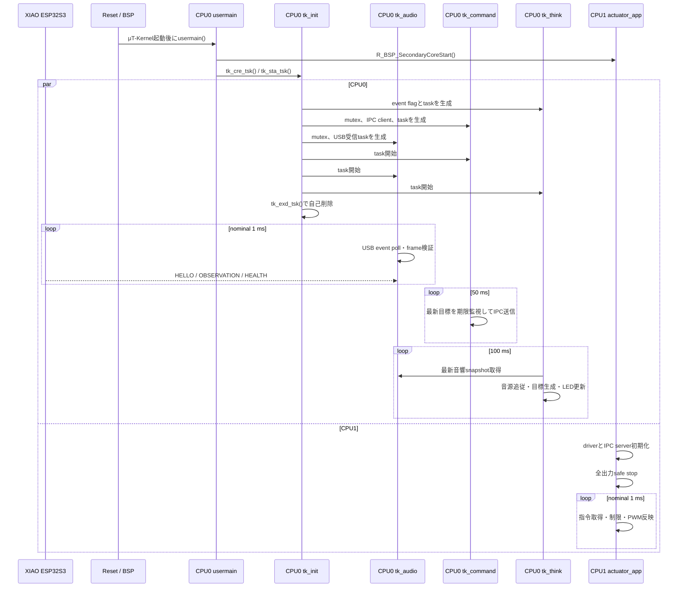
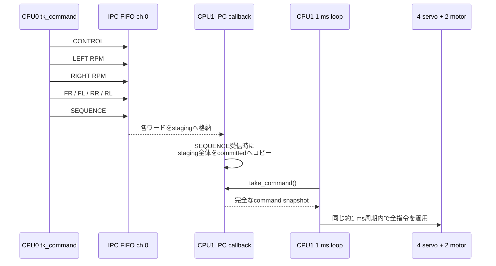
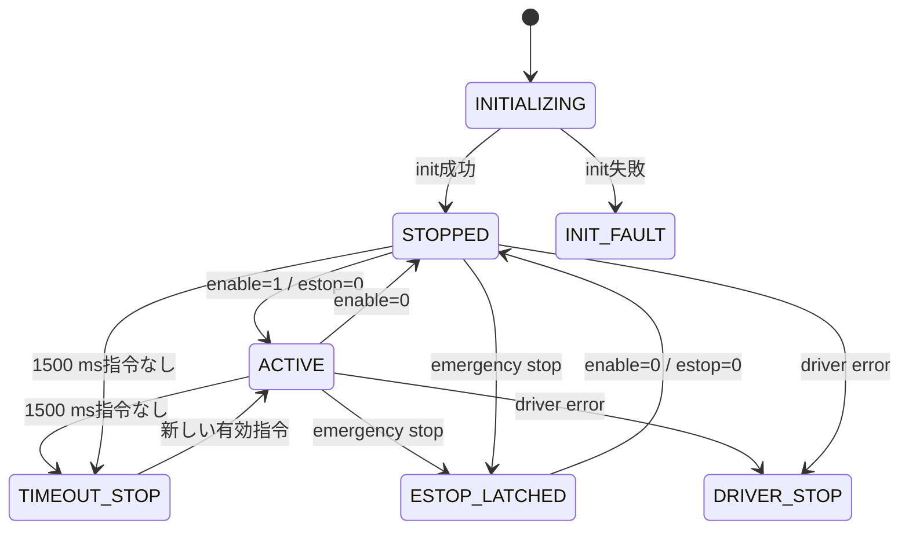
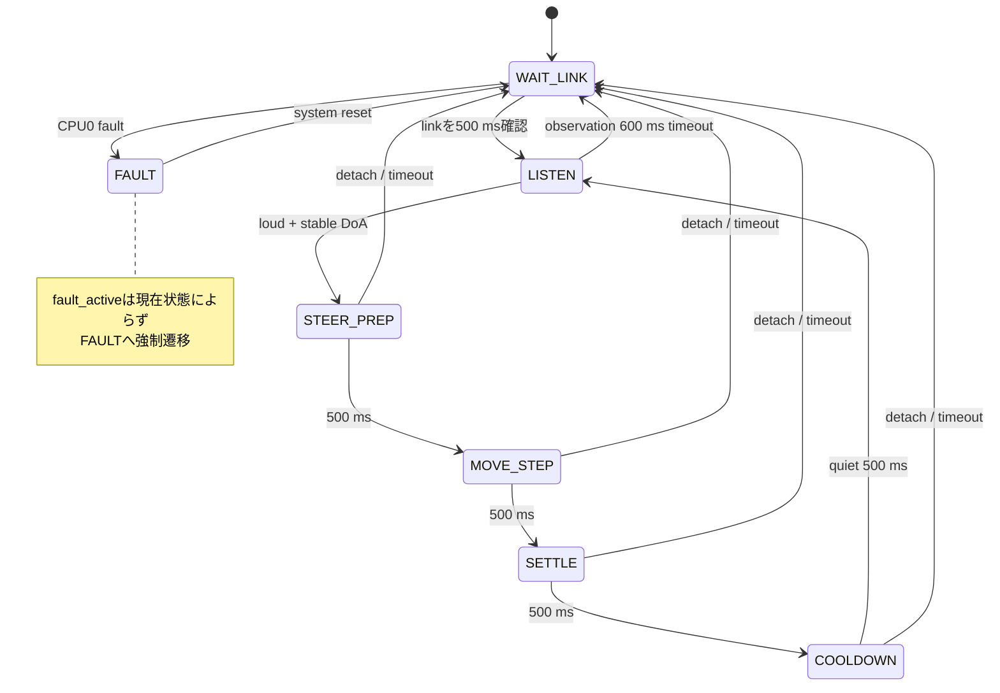
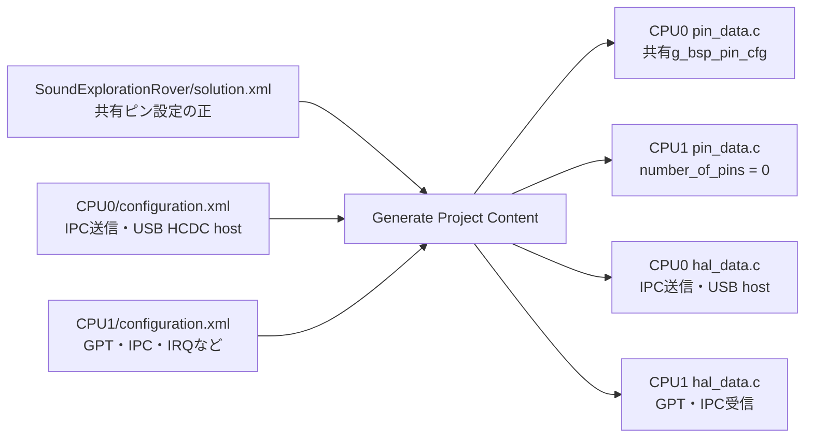

# RA8P1 ソフトウェア設計書

最終更新: 2026-08-24 / 対象: RA8P1、ReSpeaker/XIAO統合の現行実装

## 1. 目的と設計方針

この文書は、Sound Exploration Roverについて、XVF3800、XIAO ESP32S3、RA8P1 CPU0/CPU1の責務、μT-Kernelタスク、USB音響入力、CPU間通信、アクチュエータ制御、安全動作、FSP生成コードとの境界を現行ソースに対応させて説明する。ReSpeakerの配線、USB protocol、DoA校正、段階試験の詳細は[ReSpeaker統合設計](RESPEAKER_INTEGRATION.md)に分離する。

設計上の要点は次のとおりである。

1. XVF3800はDoA/VADと処理済み音声を生成し、XIAO ESP32S3は音響・無線フロントエンドとして観測値を整形する。
2. CPU0（Cortex-M85）はUSB hostとして音響観測を検証し、μT-Kernel上で音源追従判断と指令送信を行う。
3. CPU0の`tk_init`、`tk_audio`、`tk_think`、`tk_command`は、それぞれ`tk_cre_tsk()`で生成する独立カーネルタスクである。
4. CPU1（Cortex-M33）はベアメタルの約1 msループで指令を検証し、4サーボと論理左右DCモーターを駆動する。
5. 6個のアクチュエータ指示値は、IPCの`SEQUENCE`をcommit markerとして1つのスナップショットで確定する。
6. USBや音響データが異常・timeoutになってもCPU1の実時間制御を巻き込まず、CPU0停止目標とCPU1ローカルtimeoutを重ねる。
7. CPU0とCPU1は1個のRA8P1内の2コアであり、物理ピンを共有する。ピン多重化設定はSolutionを正として一元管理する。

## 2. システム全体像

| 要素 | 実行方式 | 主責務 |
|---|---|---|
| XVF3800 | 専用audio firmware | 4マイクDSP、DoA、VAD、処理済みI2S音声 |
| XIAO ESP32S3 | ESP-IDF / FreeRTOS | I2S/I2C取得、dBFS算出、USB CDC device、frontend health、Wi-Fi UDP診断gateway |
| CPU0 / Cortex-M85 | μT-Kernel 3.0 | USB HCDC host、観測検証、思考、走行目標、IPC送信、青/緑LED |
| CPU1 / Cortex-M33 | ベアメタル無限ループ | IPC受信、制限、安全監視、PWM/GPIO、encoder、赤LED |

CPU0の主周期はcommand 50 ms、think 100 msで、CPU1はnominal 1 msである。IPC channel 0はCPU0が送信ポーリング、CPU1が受信IRQ/callbackとして使う。USB eventはCPU0の`tk_audio`がtask contextからpollし、USB callbackからμT-Kernel APIを直接呼ばない。

```mermaid
flowchart LR
    subgraph HEAD["音声・無線フロントエンド"]
        MIC["4-mic array"] --> XVF["XVF3800<br/>DoA / VAD / processed audio"]
        XVF -->|"I2S / I2C"| ESP["XIAO ESP32S3<br/>level / protocol / health / UDP"]
        ESP -->|"Wi-Fi UDP JSON Lines"| PC["診断PC / nc"]
    end

    subgraph MCU["RA8P1 MCU"]
        subgraph CPU0["CPU0 / Cortex-M85 / μT-Kernel"]
            INIT["tk_init<br/>子タスク生成後に自己削除"]
            AUDIO["tk_audio<br/>USB HCDC・frame検証"]
            OBS["最新音響snapshot<br/>mutex保護"]
            THINK["tk_think / 100 ms<br/>音源追従状態機械・青/緑LED"]
            COMMAND["tk_command / 50 ms<br/>期限監視・6出力一括送信"]
            CLIENT["IPC client<br/>32 bitワード列へ変換"]
            INIT --> AUDIO
            INIT --> THINK
            INIT --> COMMAND
            AUDIO --> OBS
            OBS --> THINK
            THINK -->|"mutexで保護した最新目標"| COMMAND
            COMMAND --> CLIENT
            COMMAND -->|"fault event flag"| THINK
        end

        FIFO["IPC message FIFO<br/>channel 0"]

        subgraph CPU1["CPU1 / Cortex-M33 / bare metal"]
            SERVER["IPC server<br/>staging・commit"]
            APP["actuator_app / 約1 ms<br/>制限・安全状態・指令適用"]
            SERVO["servo driver<br/>論理FR / FL / RR / RL"]
            MOTOR["dc_motor driver<br/>論理左 / 論理右"]
            ENC["encoder driver<br/>左右代表A/B・4逓倍・RPM"]
            RED["赤LED<br/>CPU1状態"]
            SERVER --> APP
            APP --> SERVO
            APP --> MOTOR
            ENC -.-> APP
            APP --> RED
        end

        CLIENT -->|"CPU0 → CPU1"| FIFO
        FIFO -->|"受信IRQ"| SERVER
    end

    ESP -->|"J7 USB HS<br/>音響frame"| AUDIO
    AUDIO -.->|"診断snapshot / Bulk OUT"| ESP
    SERVO --> WHEELS["4輪操舵サーボ"]
    MOTOR --> BTS["論理左右 BTS7960"]
    BTS --> DCM["左右 DCモーター"]
```



アクチュエータ制御経路はCPU0からCPU1への一方向である。USB CDCだけは音響観測のESP32S3→CPU0と診断snapshotのCPU0→ESP32S3を双方向に使う。UDPは外部診断専用で、PCやESP32S3からCPU1へ制御を迂回させない。将来Wi-Fi手動操作を追加する場合も、CPU0を権限・安全・timeoutの境界として維持する。

## 3. ソースコード構成

```text
firmware/
├─ common/
│  ├─ acoustic_protocol.h/.c          ESP32S3/CPU0共通USB protocol
├─ respeaker_xiao_esp32s3/
│  ├─ CMakeLists.txt                  ESP-IDF project
│  └─ main/
│     ├─ app_main.c                   frontend初期化入口
│     ├─ xvf3800_control.c/.h         I2C DoA/VAD取得
│     ├─ audio_capture.c/.h           I2S取込・dBFS算出
│     ├─ acoustic_frontend.c/.h       観測/health生成
│     ├─ usb_link.c/.h                TinyUSB CDC双方向device
│     └─ wifi_telemetry.c/.h           Wi-Fi station・UDP JSON診断
└─ ra8p1/
   ├─ SoundExplorationRover/
   │  └─ solution.xml                 デュアルコアSolution、共有ピン設定
   ├─ common/
   │  └─ ipc_message.h                CPU0/CPU1共通actuator IPC契約
   ├─ SoundExplorationRover_CPU0/
   │  ├─ configuration.xml            IPC、USB HCDC hostなどのFSP設定
   │  ├─ mtk3_bsp2/                   μT-Kernel本体・FSPポート
   │  ├─ ra/、ra_cfg/、ra_gen/        FSPコード・設定・生成物
   │  └─ src/
   │     ├─ hal_entry.c               μT-Kernel起動入口
   │     ├─ app/main.c                CPU1とtk_initの起動
   │     ├─ app/tasks/task_common.h   CPU0共通fault定義
   │     ├─ app/tasks/tk_init.c       独立タスク生成・開始
   │     ├─ app/tasks/tk_audio.c      USB event、frame parser、音響snapshot
   │     ├─ app/tasks/tk_think.c      音源追従、青/緑LED、faultラッチ
   │     ├─ app/tasks/tk_command.c    目標共有、期限監視、IPC送信
   │     ├─ app/control/sound_follow_controller.c
   │     │                              停止聴取型の状態機械
   │     ├─ ipc/actuator_ipc_client.c IPC送信処理
   │     └─ cpu0_config.h             周期、閾値、優先度、LED設定
   └─ SoundExplorationRover_CPU1/
      ├─ configuration.xml            GPT、IPC、IRQ設定
      ├─ ra/、ra_cfg/、ra_gen/        FSPコード・設定・生成物
      └─ src/
         ├─ hal_entry.c               約1 msループ、赤LED
         ├─ app/actuator_app.c        指令検証、安全状態、driver統合
         ├─ ipc/actuator_ipc_server.c IPC受信・スナップショット確定
         ├─ drivers/servo.c           4サーボPWM
         ├─ drivers/dc_motor.c        左右モーターPWM・ランプ
         ├─ drivers/encoder.c         A/B相カウント・RPM算出
         └─ cpu1_config.h             制限、PWM、校正
```

主要ファイル:

- 共通契約: [`acoustic_protocol.h`](../../firmware/common/acoustic_protocol.h)、[`ipc_message.h`](../../firmware/ra8p1/common/ipc_message.h)
- 音響frontend: [`acoustic_frontend.c`](../../firmware/respeaker_xiao_esp32s3/main/acoustic_frontend.c)、[`xvf3800_control.c`](../../firmware/respeaker_xiao_esp32s3/main/xvf3800_control.c)、[`audio_capture.c`](../../firmware/respeaker_xiao_esp32s3/main/audio_capture.c)、[`usb_link.c`](../../firmware/respeaker_xiao_esp32s3/main/usb_link.c)
- CPU0: [`main.c`](../../firmware/ra8p1/SoundExplorationRover_CPU0/src/app/main.c)、[`tk_init.c`](../../firmware/ra8p1/SoundExplorationRover_CPU0/src/app/tasks/tk_init.c)、[`tk_audio.c`](../../firmware/ra8p1/SoundExplorationRover_CPU0/src/app/tasks/tk_audio.c)、[`tk_think.c`](../../firmware/ra8p1/SoundExplorationRover_CPU0/src/app/tasks/tk_think.c)、[`sound_follow_controller.c`](../../firmware/ra8p1/SoundExplorationRover_CPU0/src/app/control/sound_follow_controller.c)、[`tk_command.c`](../../firmware/ra8p1/SoundExplorationRover_CPU0/src/app/tasks/tk_command.c)
- CPU1: [`actuator_app.c`](../../firmware/ra8p1/SoundExplorationRover_CPU1/src/app/actuator_app.c)、[`actuator_ipc_server.c`](../../firmware/ra8p1/SoundExplorationRover_CPU1/src/ipc/actuator_ipc_server.c)、[`servo.c`](../../firmware/ra8p1/SoundExplorationRover_CPU1/src/drivers/servo.c)、[`dc_motor.c`](../../firmware/ra8p1/SoundExplorationRover_CPU1/src/drivers/dc_motor.c)

`ra/`、`ra_cfg/`、`ra_gen/`、`configuration.xml`はFSP設定と生成処理に属する。特に`ra_gen/`は直接編集せず、設定変更後にGenerate Project Contentで再生成する。

## 4. 起動シーケンス



`usermain()`はCPU1と`tk_init`を起動して永久休止する。`tk_init`は子タスクの資源をすべて生成してから`tk_command`、`tk_audio`、`tk_think`の順で開始し、正常時は自己削除する。初期化に失敗した場合は生成済みの子資源を解放し、青・緑LEDによるfault表示を続ける。

`tk_dly_tsk()`およびCPU1の`R_BSP_SoftwareDelay()`を使うため、記載周期は処理時間を含まないnominal値であり、ハードウェアタイマー基準の厳密な周期ではない。

## 5. CPU0タスク設計

| タスク | 優先度 | スタック | 実行 | 責務 |
|---|---:|---:|---|---|
| `cpu0_init_task` | 5 | 1024 B | 起動時1回 | 資源と子タスクの生成・開始後に自己削除 |
| `cpu0_command_task` | 6 | 1024 B | 50 ms | 最新目標、500 ms期限監視、6出力のIPC一括送信 |
| `cpu0_audio_task` | 8 | 2048 B | nominal 1 ms poll | HCDC event、stream parser、最新音響snapshot |
| `cpu0_think_task` | 10 | 1024 B | 100 ms | 音源追従、状態遷移、青/緑LED、faultラッチ |

μT-Kernelでは数値が小さいほど高優先度である。IPC keep-aliveを行う`tk_command`を最優先の周期task、USBを受ける`tk_audio`をその次、判断を行う`tk_think`をその次とし、通信処理が一時的に増えてもCPU1への指令更新を優先する。

### 5.1 目標データの流れ

`tk_audio`はCDC byte streamを共有protocol parserへ渡し、CRC、version、length、sequenceを検証して最新観測を優先度継承mutex内へcommitする。USB detach時は古い観測を即座に無効化する。

`tk_think`は100 msごとに音響snapshotを取得する。`tk_audio`が持つ観測時刻に加え、`tk_think`自身も観測専用sequenceの変化から`g_cpu0_think_observation_watchdog_ms`を更新し、どちらかが600 msの期限を満たさない観測は`sound_follow_controller`へ渡さない。controller出力を`rover_motion_target_t`へ展開し、左右モーター、FR/FL/RR/RL、enable、emergency stopを一括更新する。`cpu0_command_set_target()`は構造体全体を別の優先度継承mutexで保護する。

`tk_command`は50 msごとにmutex内の構造体をコピーし、次のIPC処理をmutex外で行う。目標更新が500 ms途絶した場合は`enable=0`、`emergency_stop=1`へ置き換え、faultを`tk_think`のイベントフラグへ通知する。

起動時または緊急停止後は、有効指令の前に`enable=0`かつ`emergency_stop=0`のフレームを1回送る。これはCPU1の緊急停止ラッチ解除手順を満たすためである。

### 5.2 CPU0 LED表示

CPU0の`tk_think`が青LED（LED1/P600）と緑LED（LED2/P303）を一括して所有する。CPU1は赤LED（LED3/PA07）だけを使うため、両コアが同じLEDを同時操作しない。

| 表示 | 意味 |
|---|---|
| 青を500 msごとに反転、緑消灯 | USB link待ち・safe stop |
| 青を1秒ごとに100 ms点灯 | 停止して音を聴取中 |
| 青を125 msごとに反転 | 目標方向へservo整定中 |
| 青点灯 | 500 msの短距離移動中 |
| 青を250 msごとに反転 | settleまたはcooldown中 |
| 緑を1秒ごとに100 ms点灯 | link待ち以外の`tk_think` heartbeat |
| 緑点灯＋青をN回点滅 | CPU0 fault。Nがfault番号 |
| 赤を500 msごとに反転 | CPU1正常heartbeat |
| 赤を約50 msごとに反転 | CPU1 driver/FSP error |

CPU0 fault番号は、1がtask create/start、2がIPC初期化、3がIPC送信、4が目標タイムアウト、5がUSB初期化、6が目標共有失敗である。複数faultがある場合は小さい番号を優先表示し、`g_cpu0_fault_flags`には全bitを保持する。

## 6. CPU間IPC設計

### 6.1 通信形式

FSPのIPC FIFOは4段、1要素32 bitである。共有C構造体を直接書かず、上位8 bitをID、下位24 bitをpayloadとして送る。

```text
31                    24 23                              0
+-----------------------+--------------------------------+
| message ID (8 bit)    | payload (24 bit)               |
+-----------------------+--------------------------------+
```

| ID | 名前 | payload |
|---:|---|---|
| `0x01` | CONTROL | bit 0: enable、bit 1: emergency stop |
| `0x02` | LEFT_TARGET_RPM | signed 16 bit |
| `0x03` | RIGHT_TARGET_RPM | signed 16 bit |
| `0x04` | FR_TARGET_DEG | signed 16 bit |
| `0x06` | FL_TARGET_DEG | signed 16 bit |
| `0x07` | RR_TARGET_DEG | signed 16 bit |
| `0x08` | RL_TARGET_DEG | signed 16 bit |
| `0x05` | SEQUENCE | 24 bit、1フレームのcommit marker |

### 6.2 6出力の一括commit



ここで「同時」とは、6値を分割受信中の中途半端な組合せで適用せず、1つのcommit済みスナップショットとしてCPU1の同じ制御ループで適用することを意味する。物理PWM波形が完全に同一クロックエッジで変化することを保証するものではない。

CONTROLでemergency stopを受けた場合だけは、残りのワードとSEQUENCEを待たずにcommitする。実際の出力停止はIRQ内ではなくCPU1の次回ループで行う。CPU0はFIFO overflow時に1 ms待って同じワードを再送する。

## 7. CPU1アクチュエータ設計

### 7.1 制御ループと安全状態

`actuator_app_run_1ms()`は、driver housekeeping、IPC異常取得、新しいcommit済み指令の取得、期限監視、サーボとモーターへの適用、status更新を行う。最終IPC指令から1500 ms以上経過するとローカルsafe stopへ移行する。



`safe stop`は左右モーターenableをLow、RPWM/LPWMの4出力を0、GPT10/GPT7を停止し、4本のサーボGPTも停止する。サーボを0度へ戻してから停止するのではなく、その時点でPWM信号を停止する。

### 7.2 サーボ制御

配列順は全レイヤーで`FR=0、FL=1、RR=2、RL=3`に統一する。角度はCPU1で-45～+45度へ制限し、現在は次の線形変換を行う。

```text
-45 deg -> 1200 us
  0 deg -> 1500 us + wheel trim
+45 deg -> 1800 us
```

最終パルス幅は1000～2000 usへ制限する。各輪の`SERVO_CENTER_TRIM_US_*`で機械原点、`SERVO_DIRECTION_*`で取付方向を補正する。CPU0から最初の有効IPC指令を受けた時点で4本のPWMを開始する。

### 7.3 DCモーター制御

論理左右各1台のBTS7960へ、RPWM用GPT10A/BとLPWM用GPT7A/Bの20 kHz PWMを出す。実機の前後認識に合わせ、`cpu1_config.h`で論理左右を初期の物理左右から交換している。RPM指令を基本PWMへ換算し、各側の代表エンコーダ実測RPMとの差を比例補正する。

```text
target RPM -> duty permille = target * 1000 / 300 RPM
0～700 permilleに制限
1 msごとに2 permilleずつ目標へランプ
5 msごとにGPT10A/BおよびGPT7A/Bへ反映
```

論理正RPMは車体前進として扱う。現在の実機配線では論理正RPMを左右ともLPWMへ、負RPMを左右ともRPWMへ出す。符号は`MOTOR_CHASSIS_FORWARD_SIGN=-1`、`MOTOR_LEFT_MOUNT_SIGN=+1`、`MOTOR_RIGHT_MOUNT_SIGN=+1`から合成する。同じ側のRPWM/LPWMは相互排他的に更新し、同時Highを避ける。停止時は4出力を0にしてから共通ENをLowにする。

指令開始から150 msは停止直後の0 RPMを使わず、基本PWMだけで立ち上げる。その後は100 ms周期の代表エンコーダ実測値を使い、目標との差へ2 permille/RPMの比例補正を加える。補正は±250 permille、最終PWMは0～700 permilleに制限する。左右の速度差には追従するが、各側3台のモーターを個別に制御するものではない。

## 8. 停止聴取型の音源追従

`tk_think`は[`sound_follow_controller.c`](../../firmware/ra8p1/SoundExplorationRover_CPU0/src/app/control/sound_follow_controller.c)を100 msごとに更新する。USB linkと観測が500 ms安定した後だけ待受へ入り、-45 dBFS以上のlevelと5 sampleのDoA安定性を満たすと操舵する。VAD必須化は設定で選べるが、現行値は無効である。DoAの前半球では前進、後半球では後進を選ぶ。側方は最大45度の4輪逆相操舵に加え、内輪を90 RPM相当へ減速する。検出時にDoAと走行目標を固定し、500 msのservo整定後に500 msだけ移動する。servoを直進へ戻して500 ms停止した後は、500 msの静音を確認するまで次の検出を受け付けない。



車体相対角は前0度、右正、左負で、正面±15度は0度操舵とする。正面以外は絶対値20～45度へ制限し、前輪FR/FLをその符号、後輪RR/RLを逆符号へ展開する。左右モーターを逆転させるその場旋回は使わない。`FAULT`へ入る原因bitは実行中にclearせず、復帰には原因除去後のsystem resetが必要である。動作値、USB protocol、DoA座標校正、安全な試験順は[ReSpeaker統合設計](RESPEAKER_INTEGRATION.md)を参照する。

## 9. FSP、Solution、ピン設定



同じRA8P1のIOPORTを共有するため、同一ピンをCPU0/CPU1へ独立に設定すると重複警告や上書きが発生する。現行構成ではSolutionを正とし、CPU0の`pin_data.c`に共有ピンを生成し、CPU1の`pin_data.c`は0ピンのままとする。GPT、IPC、USBなどのmodule設定は実際にAPIを使うCPU側へ生成する。

### 9.1 USB High Speed割当

XIAO ESP32S3はJ7へ接続し、CPU0のFSPにHCDC ACM host、High Speed、USB IP1を配置する。上位model名は`g_hcdc0`、USB Basic instanceは`g_basic0`である。DMA、hub、multi CDCは無効、callback/contextは`NULL`とし、USBHS main/D0FIFO/D1FIFOの3 IRQ priorityを12とする。CPU0は送信IPCとUSB hostを所有し、CPU1はアクチュエータだけを所有する。

| 用途 | FSP / GPIO | MCUピン | 外部コネクタ |
|---|---|---|---|
| USB HS data | USB IP1 | dedicated USBH_P / USBH_N | J7 USB-C |
| USB HS VBUS sense | `USBHS_VBUS` | P408 | J7内部 |
| USB HS VBUS enable | `USBHS_VBUSEN` | PD07 | J7内部、host時High |

J11/USB Full Speed、P500、`USB_FS_VBUSEN`はReSpeaker経路に使用しない。host hubとDMAは初期構成で無効とし、1台のCDC ACM deviceをpolling event APIで扱う。接続・給電・FSP設定の詳細は[ReSpeaker統合設計](RESPEAKER_INTEGRATION.md#4-ek-ra8p1-usb接続)を参照する。

### 9.2 アクチュエータ割当

以下の表の「論理左／論理右」「論理FR／FL／RR／RL」は、CPU0のIPC指令で使用する名称である。実機を前方から見た左右が初期ソフトの認識と反対だったため、物理ピンの割り当てを論理名へ付け替え、FSP生成インスタンス名も論理名に統一している。ピン番号とSolutionの共有ピン設定は変更していない。

| 用途 | FSPインスタンス | FSP出力 / GPIO | MCUピン | 外部コネクタ |
|---|---|---|---|---|
| 論理サーボFR | `g_servo_pwm_fr` | GPT12B | P803 | Pmod1 J26-4 / SCK |
| 論理サーボFL | `g_servo_pwm_fl` | GPT9B | P110 | Arduino J24-2 / D9 |
| 論理サーボRR | `g_servo_pwm_rr` | GPT11B | P801 | Pmod1 J26-2 / MOSI |
| 論理サーボRL | `g_servo_pwm_rl` | GPT13B | P808 | Arduino J23-1 / D0 |
| 論理左モーターPWM | GPT10B | P811 | Arduino J23-4 / D3 |
| 論理右モーターPWM | GPT10A | P810 | Arduino J23-5 / D4 |
| 論理左モーターLPWM | GPT7B | P602 | Pmod2 J25-3 / MISO |
| 論理右モーターLPWM | GPT7A | P603 | Pmod2 J25-2 / MOSI |
| 左右BTS7960共通EN | GPIO | PD01 | Arduino J24-1 / D8、左右ENへ分岐 |
| 予備GPIO | 未使用 | P312 | Arduino J23-8 / D7（解放） |
| 論理左代表エンコーダA | IRQ16 | P011 | Arduino J23-3 / D2 |
| 論理左代表エンコーダB | IRQ20 | P809 | Arduino J23-2 / D1 |
| 論理右代表エンコーダA | IRQ11 | P006 | Pmod1 J26-7 / IRQ |
| 論理右代表エンコーダB | IRQ18 | P413 | Pmod1 J26-10 / GPIO2 / IRQ |

エンコーダのFSPインスタンス名も論理名に揃え、論理左A/Bは`g_encoder_left_a_irq`／`g_encoder_left_b_irq`、論理右A/Bは`g_encoder_right_a_irq`／`g_encoder_right_b_irq`とする。

P801、P803、P808をサーボへ転用しているため、現行構成ではOcto-SPIフラッシュを使用できない。SW4-3をONにしてOcto-SPIを無効、SW4-4をONにしてArduino端子を有効にする。LPWMはPmod2 J25-2/J25-3へ割り当て、OSPI0とは競合させない。BTS7960は左右のVCCを共通化し、R_EN/L_ENをPD01へまとめる。VCCとENは直結せず、P312は未使用のまま解放する。電源はJ18-5の+5 VをBTS7960 VCC、J18-4の+3.3 Vを左右代表エンコーダVCC、J18-6/J18-7のGNDを全機器共通GNDとして分岐する。ただしBTS7960モジュールの仕様が3.3 V対応でない場合は5 Vを使用し、電流容量が不足する場合は外部安定化電源を使用する。

## 10. 安全設計

| 監視箇所 | 条件 | 動作 |
|---|---|---|
| ESP32S3 frontend | XVF I2C失敗、I2S overrun | observation flag/statusと累積health countで通知 |
| CPU0 `tk_audio` | CRC/version/length/sequence異常 | frame破棄。正常観測が途絶えれば600 ms timeoutへ収束 |
| CPU0 `sound_follow_controller` | USB detach、HELLO未成立、観測時刻または思考側sequence watchdogが600 msの期限超過 | `WAIT_LINK`、enable=0、estop=1 |
| CPU0 `sound_follow_controller` | XVF ready以外、VADなし、I2C error、mute、I2S stale | 走行triggerへ使わず停止聴取を継続。単発のI2S overrunは診断値として記録 |
| CPU0 `tk_command` | 思考目標が500 ms更新されない | enable=0、estop=1を送信、CPU0 fault通知 |
| CPU0 IPC client | 通常指令の送信失敗 | 緊急停止送信を追加試行、CPU0 fault通知 |
| CPU1 IPC server | emergency stop受信 | SEQUENCEを待たずcommit |
| CPU1 `actuator_app` | IPC指令が1500 ms届かない | ローカルsafe stop |
| CPU1 driver統合 | driver API error | DRIVER fault、safe stop |

現状の制約は、ハードウェア非常停止入力なし、CPU間watchdogなし、各側3台の個別速度フィードバックなしである。論理左右代表モーターのA/Bを4逓倍で数え、実測値`JGA25_ENCODER_COUNTS_PER_REV=900`と100 msの差分からRPMを算出する。カウントとRPMの符号は左右とも前進が正、後進が負である。この代表RPMをCPU1内で左右別PWMの比例補正へ使う。また論理左右各3台を1台のBTS7960へ並列接続しているため、6台の個別制御には対応しない。

## 11. ビルド・生成・書き込み

基準環境はFSP 6.4.0、GNU Arm Embedded 13.2.1、e² studio 2025-12である。2026-08-24に現行RA8P1 source一式を手動で完全compile/linkし、SREC生成まで確認した。

| project | 検証結果 | text | data | bss | total |
|---|---|---:|---:|---:|---:|
| CPU0 | manual full compile/link/SREC成功、SREC 159,292 B、`nm`で未解決symbol 0 | 52,816 | 200 | 24,060 | 77,076 |
| CPU1 | full build/link/SREC成功 | 11,996 | 8 | 1,668 | 13,672 |
| XIAO ESP32S3 | ESP-IDF未導入のため実build未実施 | - | - | - | - |

RA8P1のsourceとlink成立は確認済みだが、CPU0の既存`Debug` make metadataは今回追加したsourceをまだ列挙していない。既存のincremental build結果をそのまま書き込まず、実機IDEでprojectをRefreshし、Generate Project Content、Clean、Buildを順に行う。XIAO ESP32S3は別途ESP-IDF環境でbuild/flashを完了するまでend-to-end検証済みとは扱わない。

ピンまたはFSPモジュール変更後は次の順で更新する。

1. 物理ピン多重化をSolution側で変更する。
2. GPT、IPC、IRQを実行するCPUプロジェクト側で変更する。
3. CPU0、CPU1のprojectをRefreshする。
4. CPU0、CPU1の順にGenerate Project Contentを実行する。
5. CPU0の`pin_data.c`に共有ピン、CPU1側に0ピンが生成されたことを確認する。
6. CPU0とCPU1を両方Clean/Buildする。
7. `SoundExplorationRover Debug_Multicore Launch Group`で同じビルド世代のELFを組にして書き込む。

古いSRECを個別に混在させると、IPC契約、ピン設定、制御ロジックの世代が一致しない。デュアルコア試験ではCPU0/CPU1を必ず一組で更新する。

## 12. デバッグ観測点

### CPU0

| 変数 | 確認できること |
|---|---|
| `g_cpu0_think_state` | WAIT_LINK、LISTEN、STEER_PREP、MOVE_STEP、SETTLE、COOLDOWN、FAULT |
| `g_cpu0_think_cycle_count` | 思考タスクの周期実行回数 |
| `g_cpu0_think_observation_sequence` | 思考で最後に使用した音響観測sequence |
| `g_cpu0_think_observation_watchdog_ms` | `tk_think`で同じ観測sequenceが続いた時間。600 msでlink無効、未成立時は`UINT32_MAX` |
| `g_cpu0_fault_flags` | CPU0でラッチした全fault bit |
| `g_cpu0_command_sequence` | 最終IPC sequence |
| `g_cpu0_command_send_count` | 正常にcommitした指令数 |
| `g_cpu0_command_last_error` | 最後のIPC FSP error |
| `g_cpu0_audio_usb_configured` | HCDC deviceの列挙状態 |
| `g_cpu0_audio_hello_received` | 必須capabilityを持つHELLOの成立 |
| `g_cpu0_audio_frame_count` | CRC/format検証を通過したframe数 |
| `g_cpu0_audio_crc_error_count` | CRC不一致frame数 |
| `g_cpu0_audio_format_error_count` | length/version/format異常数 |
| `g_cpu0_audio_sequence_drop_count` | 同値または逆行sequenceの破棄数 |
| `g_cpu0_audio_observation_age_ms` | 最新音響観測からの経過時間 |
| `g_cpu0_audio_observation` | 最新DoA、level、peak、VAD、status、flags |
| `g_cpu0_audio_last_error` | 最後のFSP USB error |

### CPU1

| 変数 | 確認できること |
|---|---|
| `g_servo_pulse_us[0..3]` | FR/FL/RR/RLへ計算したパルス幅 |
| `g_servo_center_trim_us[0..3]` | 各輪の原点補正 |
| `g_drive_left_duty_permille` | 左モーターの現在ランプ値 |
| `g_drive_right_duty_permille` | 右モーターの現在ランプ値 |
| `g_actuator_fault_flags` | timeout、estop、制限、driver異常 |
| `g_actuator_last_error` | 最後のFSP error |
| `g_jga25_left_encoder_count` / `g_jga25_right_encoder_count` | 左右代表モーターの4逓倍累積値 |
| `g_jga25_left_rpm_x10` / `g_jga25_right_rpm_x10` | 左右代表モーター推定RPMの10倍（100 ms更新） |

## 13. 変更時の参照先

| 変更内容 | 主に変更する場所 | 併せて確認する場所 |
|---|---|---|
| 音量閾値・DoA校正・step時間 | CPU0 `cpu0_config.h` | `sound_follow_controller.c`、実環境測定 |
| 音源追従状態遷移 | CPU0 `sound_follow_controller.c` | `tk_think.c`、`rover_motion_target_t` |
| USB音響protocol | `firmware/common/acoustic_protocol.h/.c` | ESP32S3、`tk_audio.c`、versionを同時更新 |
| XVF I2C/I2S取得 | ESP32S3 `xvf3800_control.c`、`audio_capture.c` | XVF I2S firmware、DoA/VAD実測 |
| USB host設定・J7 | CPU0 FSP、Solution Pins | HCDC/IP1/HS、P408/PD07、CPU1は変更しない |
| 指令周期・期限監視 | CPU0 `tk_command.c`、`cpu0_config.h` | CPU1 timeout |
| IPC項目追加 | `common/ipc_message.h` | client/server、両CPUを同時更新 |
| サーボ原点・方向 | CPU1 `cpu1_config.h` | `g_servo_pulse_us`を実測 |
| サーボPWMピン | Solution Pins、CPU1 GPT instance | CPU0 `pin_data.c`、配線、SW4 |
| モーターPWM・enable | Solution Pins、CPU1 GPT/GPIO | `dc_motor.c`、BTS7960配線 |
| encoder確認・RPM換算 | CPU1 IRQ・Solution Pins・`cpu1_config.h` | 4入力の配線、信号電圧、実測counts/rev |
